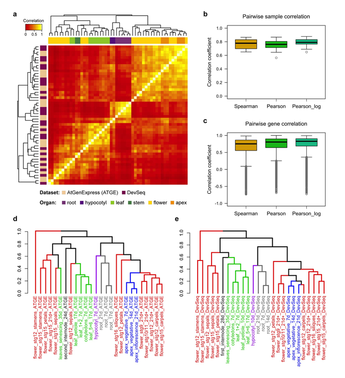

## Comparative Analysis of ATGE and DevSeq data sets

This code visualizes the results of the AtGenExpress (ATGE) and DevSeq comparative analysis, which can be found [here](https://github.com/schustischuster/ATGE-DevSeq).


## Contents

* [Getting Started](#getting-started)
  * [Required Packages](#required-packages)
  * [Data input](#data-input)
* [Visualization](#visualization)
* [Session info](#session-info)


## Getting started


### Required Packages
Install and load the following R packages before running the reproducible script:

```R

# Create list of required packages
lib_List <- c("dplyr", "gplots", "factoextra", "dendextend")

loadLibrary <- function(x) { 
    if (!require(x, character.only = T)) {
        install.packages('x')
        library(x)
    }
}

# Load packages
invisible(lapply(lib_List, loadLibrary))

```
  
### Data input
Download the entire subdirectory containing the `data` and `R` folders to the working directory on your computer, e.g. by using [GitZip](http://kinolien.github.io/gitzip/), and extract the file. Then, set the path for input and output files and source the R scripts:

```R
in_dir <- "./data"
out_dir <- "."

source("DevSeq_ATGE_plots.R")

```

## Visualization

After loading the data and sourcing the R script, run the following commands to generate the plots:

```R
# Boxplot showing pairwise ATGE-DevSeq gene correlations 
plot_Gene_Corr(spearman_RE, pearson_RE, pearson_log2_RE)

# Boxplot showing ATGE-DevSeq sample correlations
plot_Sample_Corr(atge_devseq_spearman, atge_devseq_pearson, atge_devseq_log_pearson)

# Correlation heatmap of merged ATGE-DevSeq data
makeCorrplot(atge_devseq_re, coefficient = "pearson")
makeCorrplot(atge_devseq_re_log, coefficient = "pearson")

# hclust dendrogram of ATGE and DevSeq data
makeDendrogram(atge_re, coefficient = "pearson")
makeDendrogram(devseq_re, coefficient = "pearson")

```

The plotting functions will create the panels for the following figure:





---
## Session info

```R
sessionInfo()
```

```R
#> R version 3.3.3 (2017-03-06)
#> Platform: x86_64-apple-darwin13.4.0 (64-bit)
#> Running under: OS X Mavericks 10.9.5

#> locale:
#> [1] en_US.UTF-8/en_US.UTF-8/en_US.UTF-8/C/en_US.UTF-8/en_US.UTF-8

#> attached base packages:
#> [1] stats     graphics  grDevices utils     datasets  methods   base   

#> other attached packages:
#> [1] dendextend_1.12.0 factoextra_1.0.5  ggplot2_2.2.1     gplots_3.0.1.1    dplyr_0.7.4 

#> loaded via a namespace (and not attached):
#> [1] Rcpp_0.12.14       bindr_0.1.1        magrittr_1.5       munsell_0.5.0      viridisLite_0.3.0 
#> [6] colorspace_1.3-2   R6_2.4.1           rlang_0.1.6        plyr_1.8.4         caTools_1.17.1    
#> [11] grid_3.3.3         gtable_0.3.0       KernSmooth_2.23-15 gtools_3.5.0       lazyeval_0.2.1    
#> [16] assertthat_0.2.1   tibble_1.3.4       bindrcpp_0.2       gridExtra_2.3      viridis_0.5.1     
#> [21] bitops_1.0-6       ggrepel_0.7.0      glue_1.2.0         gdata_2.18.0       scales_0.5.0      
#> [26] pkgconfig_2.0.3  

```
