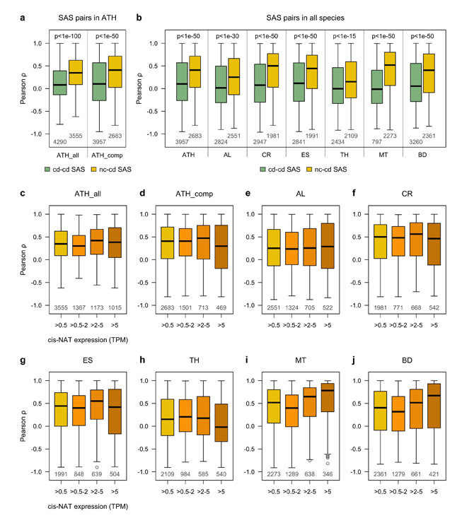

## Coding-coding SAS and non-coding-coding SAS expression analysis

This code allows to reproduce the results of the protein-coding protein-coding sense-antisense (SAS) pair and non-coding protein-coding SAS pair expression analysis. 


## Contents

* [Getting Started](#getting-started)
  * [Required Packages](#required-packages)
  * [Data input](#data-input)
* [Data analysis](#data-analysis)
  * [Get coding-coding gene overlapp](#get-coding-coding-gene-overlapp)
  * [Get non-coding-coding gene overlapp](#get-non-coding-coding-gene-overlapp)
* [Visualization](#visualization)
* [Session info](#session-info)


## Getting started


### Required Packages
Install and load the following R packages before running the reproducible scripts:

```R
if (!require(dplyr)) install.packages('dplyr')
library(dplyr)
if (!require(GenomicRanges)) install.packages('GenomicRanges')
library(GenomicRanges)
if (!require(rtracklayer)) install.packages('rtracklayer')
library(rtracklayer)

```
  
### Data input
Download the [data](https://github.com/schustischuster/evoGEx/tree/master/cisNAT/data) folder and R scripts to the working directory on your computer. Then, set the file path for input and output files and source the scripts: 

```R
in_dir <- "./data"
out_dir <- "."

source("getPcPc.R")
source("getNcPc.R")

```

## Data analysis

### Retrieve coding-coding gene overlapp

The following function will extract all protein-coding protein-coding sense-antisense (SAS) pairs from the GTF file, apply an expression threshold, compute pairwise SAS correlations across all samples, and write the results to a CSV file. The threshold is set as follows: an expression value of both sense and antisense transcript greater than 0.5 TPM in at least two out of three replicates in at least one sample type. 

```R
getPcPc(species = "ATH", experiment = "single-species")

```
To generate all data tables used in this study, execute the following function calls: 

```R
getPcPc("ATH", "single-species")
getPcPc("ATH", "comparative")
getPcPc("AL", "comparative")
getPcPc("CR", "comparative")
getPcPc("ES", "comparative")
getPcPc("TH", "comparative")
getPcPc("MT", "comparative")
getPcPc("BD", "comparative")

```

### Retrieve non-coding-coding gene overlapp

The following function will extract all non-coding protein-coding sense-antisense (SAS) pairs from the GTF file, apply an expression threshold, compute pairwise SAS correlations across all samples, and write the results to a CSV file. A sense-antisense pair is considered as expressed if both non-coding antisense and coding sense transcript reach the threshold, which can be set to any value, in at least two out of three replicates in at least one sample type. 

```R
getNcPc(species = "ATH", experiment = "single-species", threshold = 0.5)

```
To generate all data tables used in this study, execute the following function calls: 

```R
getNcPc("ATH", "single-species", 0.5)
getNcPc("ATH", "comparative", 0.5)
getNcPc("AL", "comparative", 0.5)
getNcPc("CR", "comparative", 0.5)
getNcPc("ES", "comparative", 0.5)
getNcPc("TH", "comparative", 0.5)
getNcPc("MT", "comparative", 0.5)
getNcPc("BD", "comparative", 0.5)

getNcPc("ATH", "single-species", 2)
getNcPc("ATH", "comparative", 2)
getNcPc("AL", "comparative", 2)
getNcPc("CR", "comparative", 2)
getNcPc("ES", "comparative", 2)
getNcPc("TH", "comparative", 2)
getNcPc("MT", "comparative", 2)
getNcPc("BD", "comparative", 2)

getNcPc("ATH", "single-species", 5)
getNcPc("ATH", "comparative", 5)
getNcPc("AL", "comparative", 5)
getNcPc("CR", "comparative", 5)
getNcPc("ES", "comparative", 5)
getNcPc("TH", "comparative", 5)
getNcPc("MT", "comparative", 5)
getNcPc("BD", "comparative", 5)

```

## Visualization

Set the file path for the data generated in the previous steps and source the R script:

```R
in_dir_cd <- "./output/overlapp_cd_genes"
in_dir_nc <- "./output/overlapp_nc_genes"

source("SAS_plots.R")

```

The plotting functions will generate the panels for the following figure:

&nbsp;



&nbsp;

---
## Session info

```R
sessionInfo()
```

```R
#> R version 3.3.3 (2017-03-06)
#> Platform: x86_64-apple-darwin13.4.0 (64-bit)
#> Running under: OS X Mavericks 10.9.5

#> locale:
#> [1] en_US.UTF-8/en_US.UTF-8/en_US.UTF-8/C/en_US.UTF-8/en_US.UTF-8

#> attached base packages:
#> [1] parallel  stats4    stats     graphics  grDevices utils     datasets  methods   base    

#> other attached packages:
#> [1] bindrcpp_0.2         rtracklayer_1.34.2   GenomicRanges_1.26.4 GenomeInfoDb_1.10.3  IRanges_2.8.2       
#> [6] S4Vectors_0.12.2     BiocGenerics_0.20.0  dplyr_0.7.4    

#> loaded via a namespace (and not attached):
#> [1] Rcpp_0.12.14               bindr_0.1.1                XVector_0.14.1             magrittr_1.5              
#> [5] zlibbioc_1.20.0            GenomicAlignments_1.10.1   BiocParallel_1.8.2         lattice_0.20-34           
#> [9] R6_2.4.1                   rlang_0.1.6                tools_3.3.3                grid_3.3.3                
#> [13] SummarizedExperiment_1.4.0 Biobase_2.34.0             assertthat_0.2.1           tibble_1.3.4              
#> [17] Matrix_1.2-8               bitops_1.0-6               RCurl_1.95-4.10            glue_1.2.0                
#> [21] Biostrings_2.42.1          Rsamtools_1.26.2           XML_3.98-1.9               pkgconfig_2.0.3  

```
