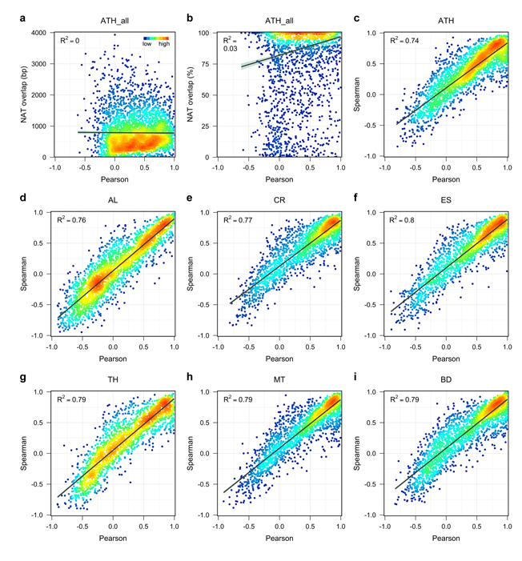

## Coding-coding SAS and non-coding-coding SAS expression analysis

This code allows to reproduce the results of the protein-coding protein-coding sense-antisense (SAS) pair and non-coding protein-coding SAS pair expression analysis. 


## Contents

* [Getting Started](#getting-started)
  * [Required Packages](#required-packages)
  * [Data input](#data-input)
* [Data analysis](#data-analysis)
  * [Retrieve coding-coding gene overlapp](#retrieve-coding-coding-gene-overlapp)
  * [Retrieve non-coding-coding gene overlapp](#retrieve-non-coding-coding-gene-overlapp)
  * [Get DevSeq-ATGE non-coding-coding SAS pairs](#get-devseq-atge-non-coding-coding-sas-pairs)
  * [Get expression intensity and ratio of SAS pairs](#get-expression-intensity-and-ratio-of-sas-pairs)
  * [Get intergenic distance of neighboring genes](#get-intergenic-distance-of-neighboring-genes)
* [Visualization](#visualization)
* [Session info](#session-info)


## Getting started


### Required Packages
Install and load the following R packages before running the reproducible scripts:

```R
if (!require(plyr)) install.packages('plyr')
library(plyr)
if (!require(dplyr)) install.packages('dplyr')
library(dplyr)
if (!require(GenomicRanges)) install.packages('GenomicRanges')
library(GenomicRanges)
if (!require(rtracklayer)) install.packages('rtracklayer')
library(rtracklayer)
if (!require(ggplot2)) install.packages('ggplot2')
library(ggplot2)
if (!require(mgcv)) install.packages('mgcv')
library(mgcv)

```
  
### Data input
Download the [data](https://github.com/schustischuster/evoGEx/tree/master/cisNAT/data) folder and [R scripts](https://github.com/schustischuster/evoGEx/tree/master/cisNAT/R) to the working directory on your computer. Then, set the file path for input and output files and source the scripts: 

```R
in_dir <- "./data"
out_dir <- "."

source("getPcPc.R")
source("getNcPc.R")
source("getDevSeq_ATGE.R")
source("getExprRatio.R")
source("getPcPcNO.R")

```

## Data analysis

### Retrieve coding-coding gene overlapp

The following function will extract all protein-coding protein-coding sense-antisense (SAS) pairs from the GTF file, apply an expression threshold, compute pairwise SAS correlations across all samples, and write the results to a CSV file. The threshold is set as follows: an expression value of both sense and antisense transcript greater than 0.5 TPM in at least two out of three replicates in at least one sample type. 

```R
getPcPc(species = c("ATH", "AL", "CR", "ES", "TH", "MT", "BD"), 
        experiment = c("single-species", "comparative"))

```
To generate all data tables used in this study, execute the following function calls: 

```R
getPcPc("ATH", "single-species")
getPcPc("ATH", "comparative")
getPcPc("AL", "comparative")
getPcPc("CR", "comparative")
getPcPc("ES", "comparative")
getPcPc("TH", "comparative")
getPcPc("MT", "comparative")
getPcPc("BD", "comparative")

```

### Retrieve non-coding-coding gene overlapp

The following function will extract all non-coding protein-coding sense-antisense (SAS) pairs from the GTF file, apply an expression threshold, compute pairwise SAS correlations across all samples, and write the results to a CSV file. A sense-antisense pair is considered as expressed if both non-coding antisense and coding sense transcript reach the threshold, which can be set to any value, in at least two out of three replicates in at least one sample type. 

```R
getNcPc(species = c("ATH", "AL", "CR", "ES", "TH", "MT", "BD"), 
        experiment = c("single-species", "comparative"), threshold)

```
To generate all data tables used in this study, execute the following function calls: 

```R
getNcPc("ATH", "single-species", 0.5)
getNcPc("ATH", "comparative", 0.5)
getNcPc("AL", "comparative", 0.5)
getNcPc("CR", "comparative", 0.5)
getNcPc("ES", "comparative", 0.5)
getNcPc("TH", "comparative", 0.5)
getNcPc("MT", "comparative", 0.5)
getNcPc("BD", "comparative", 0.5)

getNcPc("ATH", "single-species", 2)
getNcPc("ATH", "comparative", 2)
getNcPc("AL", "comparative", 2)
getNcPc("CR", "comparative", 2)
getNcPc("ES", "comparative", 2)
getNcPc("TH", "comparative", 2)
getNcPc("MT", "comparative", 2)
getNcPc("BD", "comparative", 2)

getNcPc("ATH", "single-species", 5)
getNcPc("ATH", "comparative", 5)
getNcPc("AL", "comparative", 5)
getNcPc("CR", "comparative", 5)
getNcPc("ES", "comparative", 5)
getNcPc("TH", "comparative", 5)
getNcPc("MT", "comparative", 5)
getNcPc("BD", "comparative", 5)

getNcPc("ATH", "single-species", 10)
getNcPc("ATH", "comparative", 10)
getNcPc("AL", "comparative", 10)
getNcPc("CR", "comparative", 10)
getNcPc("ES", "comparative", 10)
getNcPc("TH", "comparative", 10)
getNcPc("MT", "comparative", 10)
getNcPc("BD", "comparative", 10)

```

### Get DevSeq-ATGE non-coding-coding SAS pairs

The following function will select all non-coding protein-coding sense-antisense pairs from the DevSeq A.thaliana data table (single-species, threshold = 0.5) that have previously been identified in the AtGenExpress data set ([Henz et al., 2007](https://www.ncbi.nlm.nih.gov/pubmed/17496106)). The results will be written to a CSV file. 

```R
getDevSeq_ATGE()

```

### Get expression intensity and ratio of SAS pairs

The following function will retrieve the maximum expression level for both coding and non-coding transcripts, and will calculate the ratio between NAT and coding gene expression. The results will be written to CSV files. 

```R
in_dir <- "./output/overlap_nc_genes"

getExprRatio()

```

### Get intergenic distance of neighboring genes

Numerous studies in different model organisms have shown that neighboring genes tend to be coexpressed, e.g. [Cohen  et al. (2000)](https://www.ncbi.nlm.nih.gov/pubmed/11017073), [Boutanaev et al. (2000)](https://www.ncbi.nlm.nih.gov/pubmed/12478293), [Lercher et al. (2002)](https://www.ncbi.nlm.nih.gov/pubmed/11992122), [Lercher et al. (2003)](https://www.ncbi.nlm.nih.gov/pubmed/12566401), [Williams and Bowles (2004)](https://www.ncbi.nlm.nih.gov/pubmed/15173112). We wanted to test if a similar trend can be found in the DevSeq data set. The following function will extract all protein-coding gene pairs and their intergenic distance from the GTF file, apply an expression threshold of 0.5 TPM, compute pairwise log2 expression correlations across all samples, and write the results to a CSV file.

```R
getPcPcNO <- function(species = c("ATH", "AL", "CR", "ES", "TH", "MT", "BD"), 
                      experiment = c("single-species", "comparative"))
 
```
...

```R
in_dir <- "./output/..."

get...()

```

## Visualization

Set the file path for the data generated in the previous steps and source the R script:

```R
in_dir_cd <- "./output/overlap_cd_genes"
in_dir_nc <- "./output/overlap_nc_genes"
in_dir_ATGE <- "./output/SAS_DevSeq_ATGE"
in_dir_expr <- "./output/NAT_expr_cor"

source("SAS_plots.R")

```

The plotting functions will generate the panels for the following figures:





---
## Session info

```R
sessionInfo()
```

```R
#> R version 3.3.3 (2017-03-06)
#> Platform: x86_64-apple-darwin13.4.0 (64-bit)
#> Running under: OS X Mavericks 10.9.5

#> locale:
#> [1] en_US.UTF-8/en_US.UTF-8/en_US.UTF-8/C/en_US.UTF-8/en_US.UTF-8

#> attached base packages:
#> [1] parallel  stats4    stats     graphics  grDevices utils     datasets  methods   base    

#> other attached packages:
#> [1] mgcv_1.8-17          nlme_3.1-131         ggplot2_2.2.1        rtracklayer_1.34.2   GenomicRanges_1.26.4
#> [6] GenomeInfoDb_1.10.3  IRanges_2.8.2        S4Vectors_0.12.2     BiocGenerics_0.20.0  dplyr_0.7.4    

#> loaded via a namespace (and not attached):
#> [1] Rcpp_0.12.14               bindr_0.1.1                XVector_0.14.1             magrittr_1.5              
#> [5] zlibbioc_1.20.0            GenomicAlignments_1.10.1   munsell_0.5.0              BiocParallel_1.8.2        
#> [9] colorspace_1.3-2           lattice_0.20-34            R6_2.4.1                   rlang_0.1.6               
#>[13] plyr_1.8.4                 tools_3.3.3                grid_3.3.3                 SummarizedExperiment_1.4.0
#>[17] gtable_0.3.0               Biobase_2.34.0             lazyeval_0.2.1             assertthat_0.2.1          
#>[21] tibble_1.3.4               Matrix_1.2-8               bindrcpp_0.2               bitops_1.0-6              
#>[25] RCurl_1.95-4.10            glue_1.2.0                 scales_0.5.0               Biostrings_2.42.1         
#>[29] Rsamtools_1.26.2           XML_3.98-1.9               pkgconfig_2.0.3    

```
